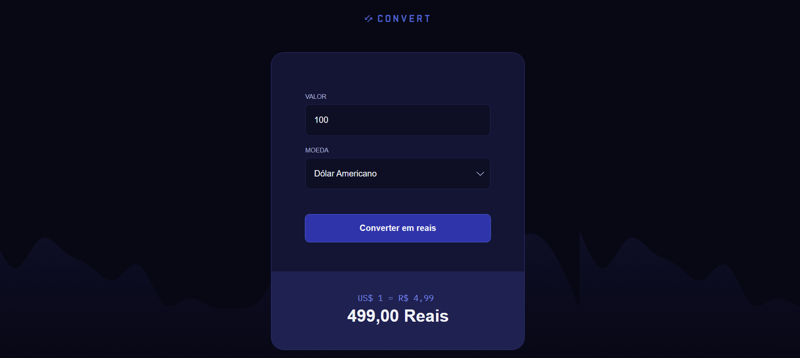

# 🎉 Convert

💻 Projeto

O Convert é um sistema de conversão de moedas com o objetivo de ajudar pessoas a verificarem, de forma simples e rápida, quanto gastariam em reais ao comprar outras moedas.
A aplicação permite informar um valor, selecionar a moeda desejada e visualizar o resultado convertido para BRL, tornando a experiência prática e intuitiva.
Este é um dos projetos desenvolvidos durante as aulas da Formação Fullstack da Rocketseat, utilizando conceitos fundamentais de HTML, CSS e JavaScript.

---

## 💻 Tecnologias Utilizadas
- HTML5
- CSS3
- Javascript
